## EyeJo

EyeJo是一款自动化资产风险评估平台，可以协助甲方安全人员或乙方安全人员对授权的资产中进行排查，快速发现存在的薄弱点和攻击面。

## 免责声明

本平台集成了大量的互联网公开工具，主要是方便安全人员整理、排查资产、安全测试等，切勿用于非法用途。使用者存在危害网络安全等任何非法行为，后果自负，作者不承担任何法律责任。

## 功能说明

| 功能             | 说明                                                                   |
| :-------------- | :-------------------------------------------------------------------- |
| 输入目标         | 支持域名、IP段、IP范围。注：输入的域名会作为主域名，除了www                  |
| 子域名收集       | 使用Oneforall收集子域名                                                 |
| Shodan和FOFA查询 | 使用Shodan API和Fofa API收集域名                                        |
| 端口扫描         | 使用naabu+nmap快速精准扫描端口服务                                       |
| 请求站点、截图    | 收集站点的网页截图、Title、icons、证书等                                  |
| 指纹识别         | 使用wappalyzer进行指纹识别（默认集成wappalyzer指纹库外加几十个常见应用指纹） |
| 登录识别         | 会调用爬虫进行识别。请求站点、截图功能默认会通过指纹去识别                   |
| FUZZ            | 使用ffuf进行目录爆破                                                     |
| POC检测          | 使用pocsuite3进行poc检测（默认集成少量POC）                               |
| 漏洞检测         | crawlergo爬虫+xray的被动扫描（平台默认关闭了xray的poc检测）                |
| 服务爆破         | 使用hydra进行相应服务的爆破（默认集成服务字典）                            |
| 结果导出         | 导出收集的资产                                                          |

## 部署方式

### docker部署

获取镜像
```sh
## 重新构建
## docker build -t eyejo_ubuntu:latest -f docker/Dockerfile .
## 拉取最新
docker pull mirchdocker/eyejo
```

一键部署
```
cd docker
docker-compose up -d
```

## 登录

[http://127.0.0.1:6103](http://127.0.0.1:6103)  
密码： admin/eyejo@666  
数据库MySQL账号密码：root/eyejo@pass

### 账号操作

删除user1用户并新增用户admin/password
```sh
docker exec -it eyejo_mariadb mysql -u root -p
## 输入密码123456
use EyeJo;
delete from auth_user where username='user1';
docker exec -it eyejo_ubuntu bash
python3 manage.py initadmin --user admin --password password --email admin@example.com
```

## 使用演示

- 平台首页
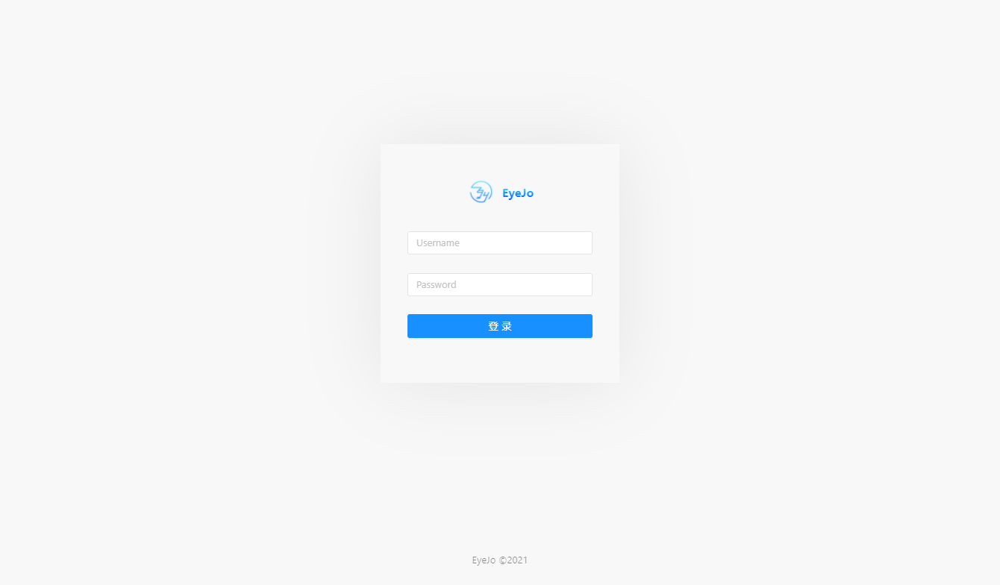

### 项目管理


1. 项目管理
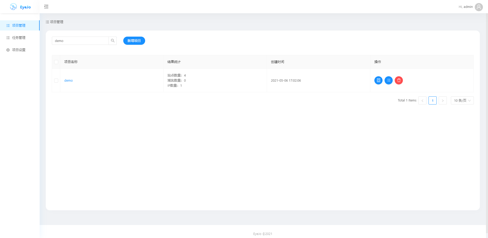
2. 新增项目
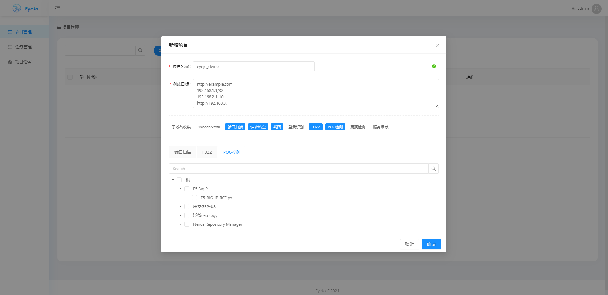

3. 项目详情
- 3.1 站点详情  
对测试目标进行信息收集工作，帮助安全人员快速了解测试目标。包括指纹、标题、图标、截图等信息  
可以自定义对单个、多个站进行tag管理，分类后，可进行tag搜索，一个项目有大量目标时可方便筛选需要的数据
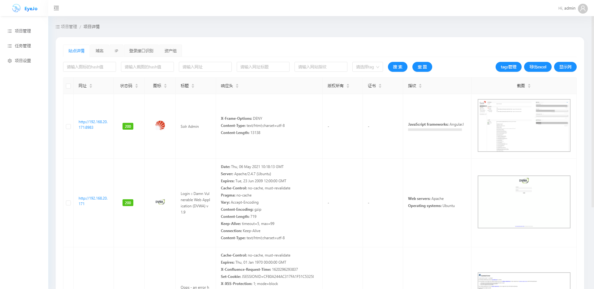
- 3.2 域名  
对测试目标收集子域名，扫描结果在此页面进行展示
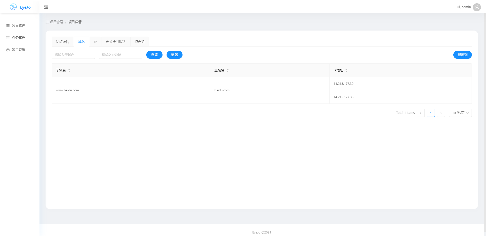
- 3.3 IP  
对测试目标的IP进行端口扫描，扫描结果在此页面进行展示；通过当前IP信息可以查看旁站和C段信息。
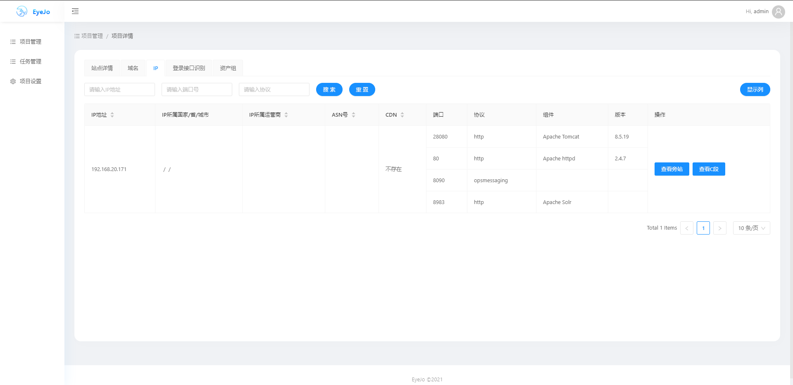
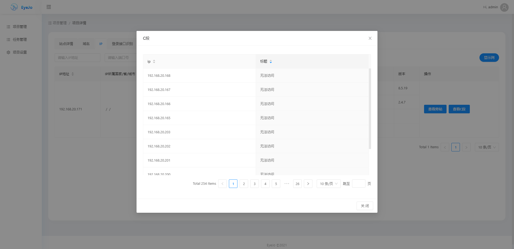
- 3.4 登录接口识别
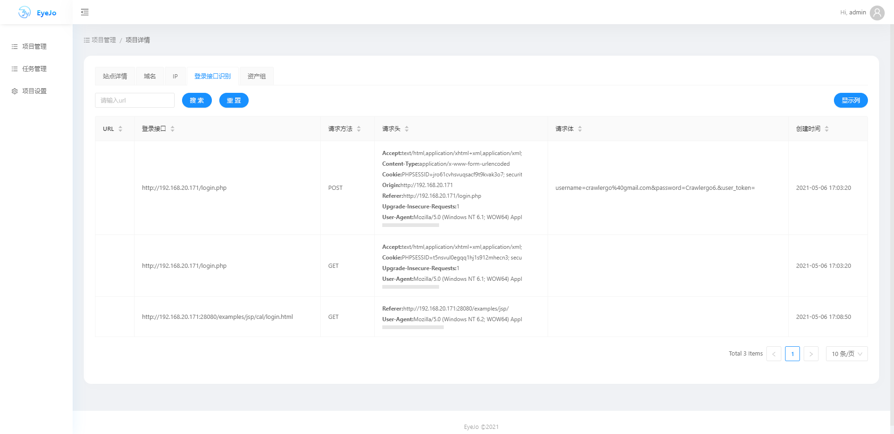
- 3.5资产组  
资产组包含了收集到的所有资产。
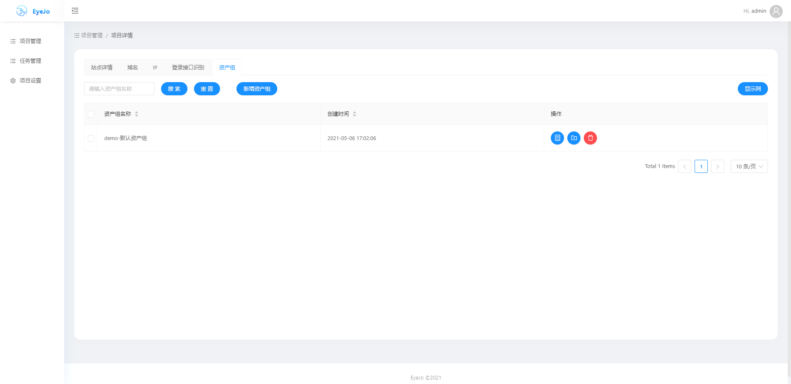
- 3.5.1 新增资产组  
新增资产组有三种方式：添加已有资产、从tag添加资产、手动输入资产
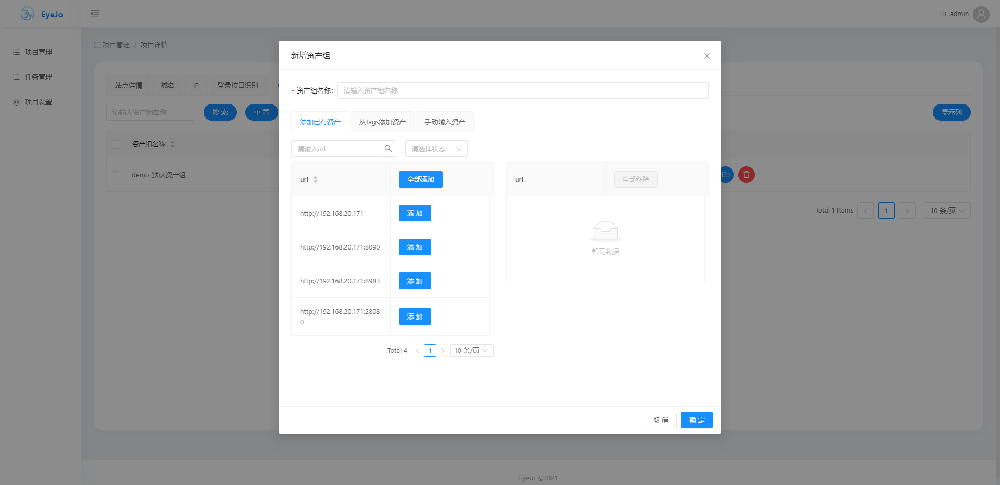
- 3.5.2 新增资产  
基于已有资产组新增资产有两种方式：从tag添加资产、手动输入资产
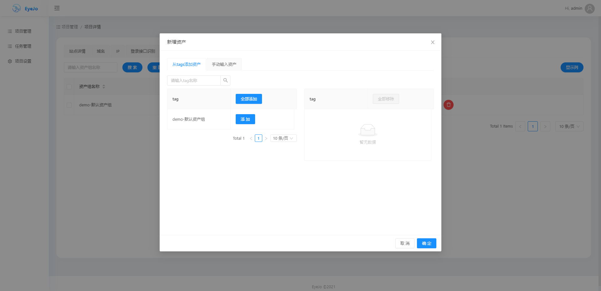

### 任务管理

1. 任务管理
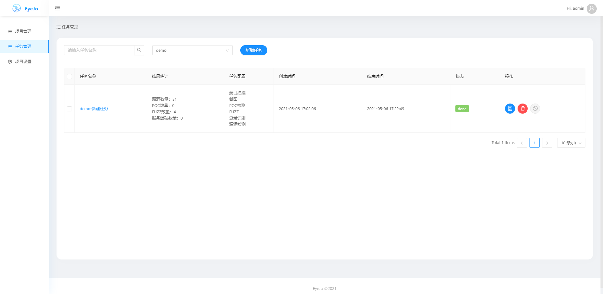
2.添加任务  
可以对已有项目的资产组添加任务
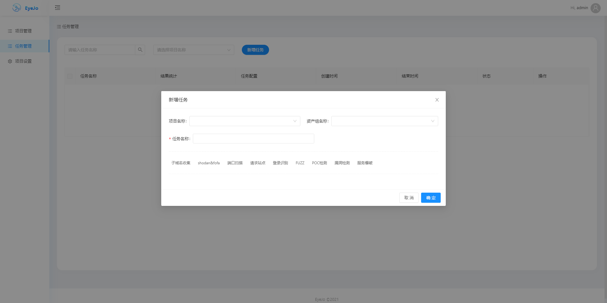
3. 漏洞  
漏洞：xray扫描结果  
POC：pocsuite3扫描结果  
fuzz：目录爆破结果  
服务爆破：端口服务爆破结果
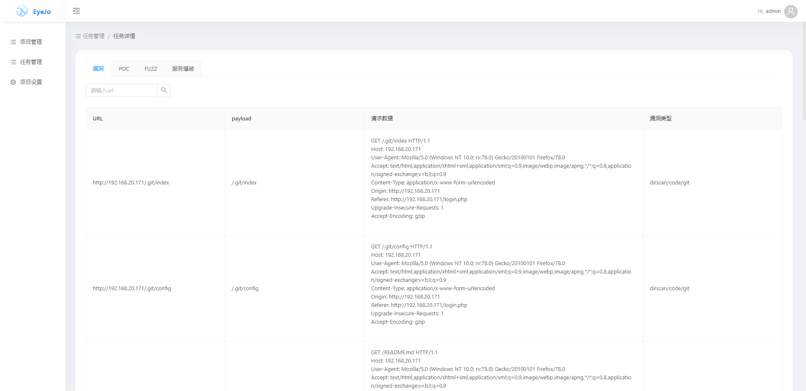
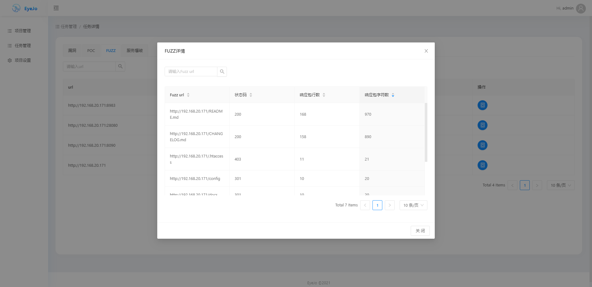

### 项目配置

1. 项目配置
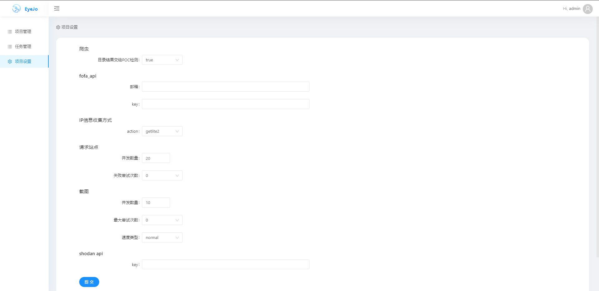


## 添加POC和指纹

可更新指纹库 **eyejo/plugin/fingermap/data/wappalyzer.json**  
可更新POC **eyejo/plugin/pocsuite3/pocs/**，[模板参考](https://github.com/ice-doom/EyeJo/wiki/POC%E5%B8%B8%E8%A7%81%E6%BC%8F%E6%B4%9E%E6%A8%A1%E6%9D%BF)


## TODO

POC、指纹管理、自定义fofa语法等  
资产监控  
漏洞消息推送


## 致谢

[https://github.com/TophantTechnology/ARL](https://github.com/TophantTechnology/ARL)  
[https://github.com/chaitin/xray](https://github.com/chaitin/xray)  
[https://github.com/ffuf/ffuf](https://github.com/ffuf/ffuf)  
[https://github.com/projectdiscovery/naabu](https://github.com/projectdiscovery/naabu)  
[https://github.com/knownsec/pocsuite3](https://github.com/knownsec/pocsuite3)  
[https://github.com/shmilylty/OneForAll](https://github.com/shmilylty/OneForAll)  
[https://github.com/0Kee-Team/crawlergo](https://github.com/0Kee-Team/crawlergo)  
[https://github.com/rverton/webanalyze](https://github.com/rverton/webanalyze)

